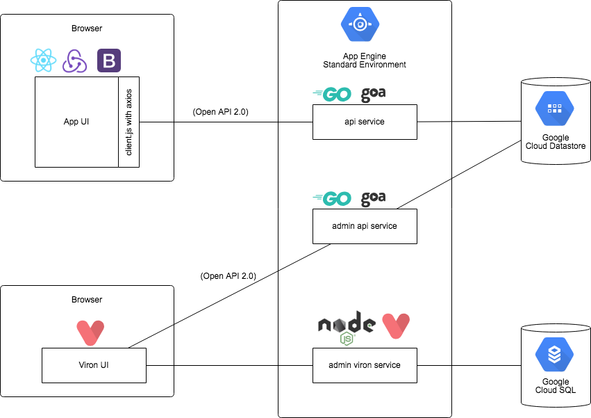

# GAE/Go Datastore Goa Goon Viron React Redux Example

## Overview

## Architecture/Libraries

- Server
  - [Google AppEngine / Go](https://cloud.google.com/appengine/docs/standard/go/)
    - The App Engine standard environment makes it easy to build and deploy an application that runs reliably under heavy load and with large amounts of data
  - [Golang](https://golang.org/)
    - Go is an open source programming language that makes it easy to build simple, reliable, and efficient software
  - [Goa](https://goa.design/)
    - goa is a holistic approach for building microservices in Go
    - goagen can generate the Swagger specification of an API given its design.
    - goa generates javascript library for client with [axios](https://github.com/axios/axios)
  - [SwaggerUI](https://swagger.io/tools/swagger-ui/)
    - Swagger UI allows anyone — be it your development team or your end consumers — to visualize and interact with the API’s resources without having any of the implementation logic in place.
  - [Datastore](https://cloud.google.com/appengine/docs/standard/go/datastore/)
    - A NoSQL document database built for automatic scaling, high performance, and ease of application development
  - [Goon](https://github.com/mjibson/goon)
    - An autocaching interface to the app engine datastore for Go
- Client
  - [ECMAScript6](https://github.com/sorrycc/awesome-javascript#es6)
  - [Rollup](https://rollupjs.org/)
    - Rollup is a module bundler for JavaScript which compiles small pieces of code into something larger and more complex, such as a library or application
  - [React](https://reactjs.org/)
    - A JavaScript library for building user interfaces
  - [Redux](https://redux.js.org/)
    - Redux is a predictable state container for JavaScript apps.
  - [Redux-saga](https://redux-saga.js.org/)
    - redux-saga is a library that aims to make application side effects (i.e. asynchronous things like data fetching and impure things like accessing the browser cache) easier to manage, more efficient to execute, simple to test, and better at handling failures
  - [axios](https://github.com/axios/axios)
    - Promise based HTTP client for the browser and node.js
  - [Bootstrap 4](https://getbootstrap.com/docs/4.1)
    - Build responsive, mobile-first projects on the web with the world's most popular front-end component library.
  - [Viron](https://cam-inc.github.io/viron-doc/)
    - A tool generates UI with [swagger/Open API](https://swagger.io/) API without coding

## Directories

| Directory | Name                   | Memo |
|-----------|------------------------|-----------|
| admin     | Admin api              | localhost:8081 for Viron, localhost:8082 for admin API |
| api       | Application API server | localhost:8080 for API |
| ui        | Application UI         | React + Redux App |
